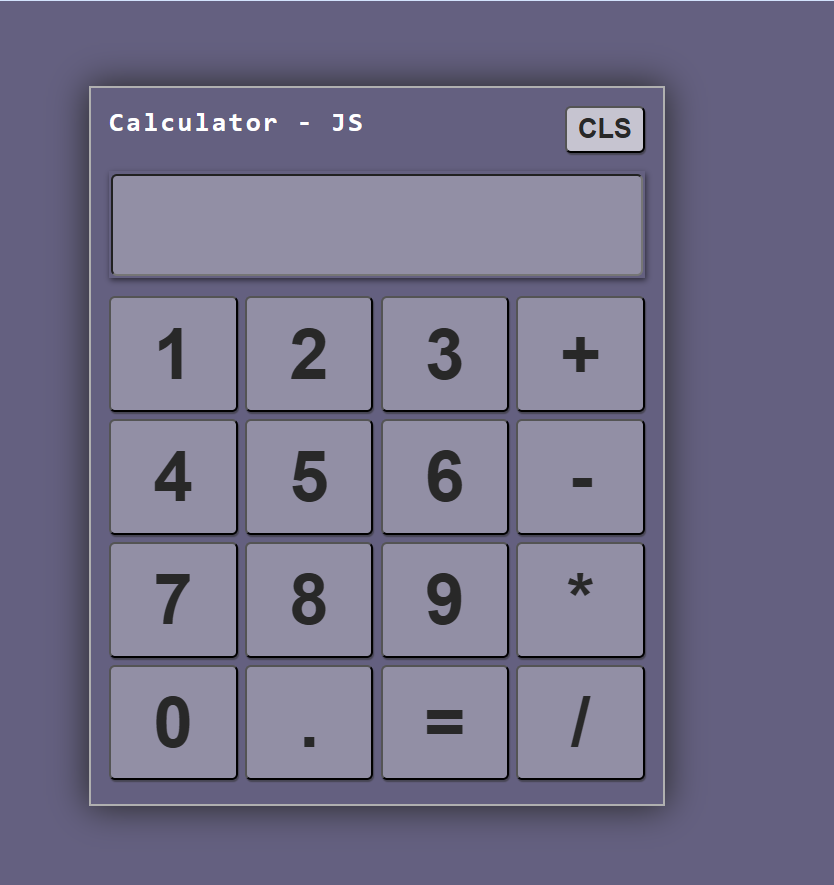

# JavaScript DOM & Browser APIs – Path

This repository documents my step-by-step journey to **master the DOM and Browser APIs** using plain JavaScript.

The goal is **deep understanding**, not shortcuts or framework magic.

I am learning DOM the same way browsers and frameworks use it:
from fundamentals → events → dynamic UI → storage → real projects.

---

## 🎯 Why this repository exists

- To master **DOM manipulation without frameworks**
- To clearly understand **how browsers work**
- To remove confusion before learning **React / Angular**
- To build real projects with confidence
- To have a **reference repo** I can revisit anytime

---

## 🧱 Learning Phases (High-Level)

### Phase 0: Browser & DOM Fundamentals
- What the browser really does
- HTML vs DOM
- DOM tree, nodes, elements
- How JS communicates with the browser

### Phase 1: DOM Selection
- getElementById
- querySelector / querySelectorAll
- NodeList vs HTMLCollection
- Live vs static collections

### Phase 2: DOM Content & Attributes
- textContent vs innerHTML
- attributes vs properties
- dataset usage
- security basics (XSS awareness)

### Phase 3: Styling & Classes
- element.style
- classList
- dynamic styling patterns

### Phase 4: Events Basics
- addEventListener
- event object
- click, input, keyboard events

### Phase 5: Event Flow (Critical)
- bubbling
- capturing
- delegation
- real-world usage patterns

### Phase 6: Dynamic DOM
- createElement
- append / remove
- building UI from JS

### Phase 7: Forms & Validation
- submit event
- preventDefault
- real-time validation
- UX-friendly errors

### Phase 8: Browser Storage APIs
- localStorage
- sessionStorage
- syncing UI with storage

### Phase 9: Mini Projects
- Todo App (DOM + events + storage)
- Form Validator
- Notes / small utilities

---

## 🚀 End Goal

After completing this repository:
- DOM will feel **natural**
- Frameworks will feel **logical**
- Debugging UI issues will be easier
- JavaScript will feel **predictable, not magical**

---

