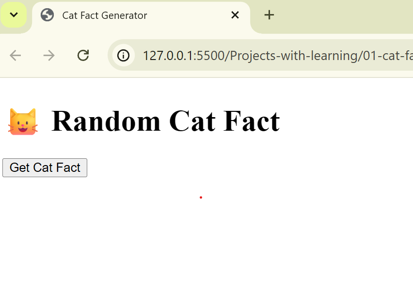

# Cat Fact Generator

## Goal
Practice async/await with a real API.

## What this step does
- Fetches a random cat fact
- Uses async/await
- Handles errors with try/catch

## Key concepts used
- fetch API
- await Promise
- response.ok check
- JSON parsing
- error handling

## Why we started with console only
To focus on logic before UI.

## Step 2: UI Integration

### What I added
- Button click event
- Loading message
- DOM updates after async call

### Concepts used
- DOM selection
- Event listeners
- async/await with UI
- error handling for users

### Key learning
Async code must update UI in a predictable order.

