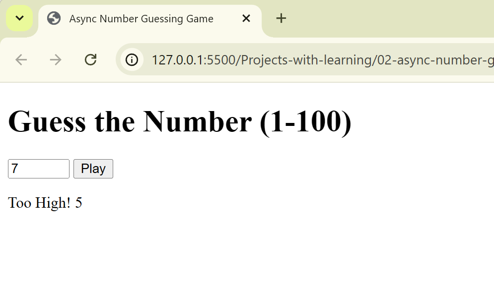

# Async Number Guessing Game

## Goal
Practice async logic using delays and decision making.

## Concepts used
- async / await
- Promises with setTimeout
- try / catch error handling
- random number generation

## Key learning
Async code is not only for APIs — it can control game logic too.

## Step 2: UI Integration

### What I added
- Input and button for user interaction
- Disabled UI during async operation
- Status messages for results and errors

### Concepts used
- DOM selection & events
- async/await with delays
- try/catch/finally for UI safety

### Key learning
Async logic + UI needs careful state control.

