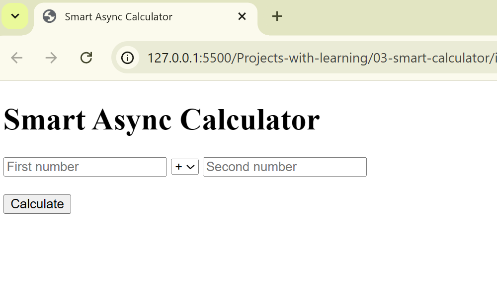

# Smart Async Calculator

## Goal
Build a calculator that uses async operations and proper error handling.

## Step 1: Core Logic
- Async calculation with delay
- Input validation
- Division by zero handling
- try/catch/finally pattern

## Key learning
Async/await is not magic — it is structured, readable logic.

## Step 2: UI Integration

### What I added
- Inputs and operator selector
- Async calculate button
- Loading state and result display
- Disabled UI during async operation

### Concepts used
- async/await with UI
- Promise-based delay
- try/catch/finally for UX safety

### Key learning
Async logic + UI requires state control, not hacks.

